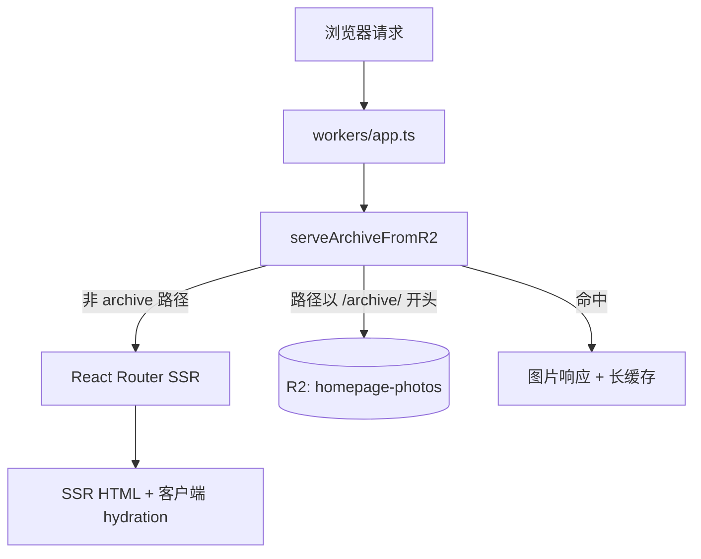

# 项目架构

个人摄影归档站点，部署在 Cloudflare Workers。首页为纵向长卷式照片浏览，辅以系列索引与管理后台（仅开发环境）。

生产地址：https://homepage.kakera.workers.dev

## 技术栈

| 层级 | 技术 |
|------|------|
| 框架 | React 19 + React Router 7（SSR） |
| 运行时 | Cloudflare Workers（`nodejs_compat`） |
| 构建 | Vite 6 + `@cloudflare/vite-plugin` + `@react-router/dev` |
| 样式 | Tailwind CSS 4 |
| 图片处理 | Sharp（本地脚本） |
| 对象存储 | Cloudflare R2（`homepage-photos` bucket） |
| 部署 | Workers Builds（`main` 分支自动构建部署） |

## 目录结构

```
homepage/
├── app/                    # React Router 应用
│   ├── routes.ts           # 路由配置（admin 仅 DEV）
│   ├── routes/             # 路由模块
│   ├── features/           # 按功能划分的 UI
│   │   ├── archive/        # 首页长卷 + 系列索引
│   │   ├── admin/          # 开发环境照片管理
│   │   └── about/
│   ├── data/               # 静态数据与 manifest
│   │   ├── series.json     # 系列与照片元数据（构建时打入 bundle）
│   │   └── series.ts       # 类型与查询 helper
│   └── shared/             # 通用组件、主题、站点配置
├── workers/
│   ├── app.ts              # Worker 入口：R2 静态资源 + SSR
│   └── archive.ts          # /archive/* 从 R2 读取
├── scripts/                # Node 本地工具链
│   ├── vite-admin-api.mjs  # 开发环境 Admin API（Vite 中间件）
│   └── lib/
│       ├── photo-pipeline.mjs  # WebP 变体生成
│       ├── manifest.mjs        # series.json 读写
│       ├── r2-sync.mjs         # 同步 public/archive → R2
│       └── paths.mjs           # 路径常量
├── public/
│   └── archive/            # 本地归档图片（开发 / 同步源）
├── wrangler.json           # Worker 与 R2 绑定
├── vite.config.ts
└── react-router.config.ts
```

## 请求处理流程



Worker 在 React Router 之前拦截 `/archive/*`：

- R2 key 为去掉前导 `/` 的路径，例如 `archive/hokkaido-2025/0001-foo-preview.webp`
- 响应头：`Cache-Control: public, max-age=31536000, immutable`，支持 `ETag` / `304`

其余路径走 React Router SSR（`entry.server.tsx` → `renderToReadableStream`）。

## 前端路由

定义于 `app/routes.ts`：

| 路径 | 模块 | 说明 |
|------|------|------|
| `/` | `routes/_index.tsx` | 长卷归档 `ArchiveScroll` |
| `/series` | `routes/series.tsx` | 系列网格索引，链到 `/?series={id}` |
| `/about` | `routes/about.tsx` | 关于页 |
| `/admin` | `routes/admin.tsx` | **仅 `import.meta.env.DEV`**，生产 404 |
| `*` | `routes/$.tsx` | 404 |

布局在 `app/root.tsx`：固定侧栏 `Header`、主题切换、按路由调整 `main` 宽度（归档页全宽，其余 `max-w-3xl` / admin `max-w-6xl`）。

## 核心功能：归档长卷

**数据**：`app/data/series.json` → `series.ts` 导出 `seriesList`、`archivePhotos`、`getSeriesById` 等。

**渲染**（`features/archive/ArchiveScroll.tsx`）：

- 按系列分段渲染 `<section>`，每张照片一个 `<figure>`
- 图片使用 `largeSrc`（生产环境为 Worker 上的绝对 URL）
- `useArchiveVisibleIndex`：滚动时计算视口中心最近的照片索引
- `useArchivePhotoPreload`：预加载前后各 2 张的 `largeSrc`
- URL `?series={id}` 触发 `scrollToSeries` 定位到对应系列

**系列索引**（`SeriesIndexPage`）：封面用 `thumbSrc`，点击跳转到首页锚点。

## 数据模型

### Photo

```ts
{
  id: string           // 如 "hokkaido-2025-0"
  seriesId: string
  thumbSrc: string     // 864px 边长 WebP
  previewSrc: string   // 1728px 边长 WebP
  largeSrc: string     // 3456px 边长 WebP（后缀 -3456）
  src: string          // previewSrc 别名，兼容旧字段
  width: number
  height: number
}
```

### SeriesManifest（`series.json`）

```ts
{
  generatedAt: string
  sourceRoot: string   // 导入来源或 "admin"
  series: Series[]
}
```

生产 manifest 中图片 URL 为绝对地址（`PHOTOS_PUBLIC_URL` + `/archive/...`）；本地开发可保持 `/archive/...` 相对路径，由 Vite 静态服务 `public/archive/`。

## 图片管线

两套入口，共用 `scripts/lib/photo-pipeline.mjs` 的 preset 逻辑：

### 1. NAS 批量导入（`npm run import:series`）

- 从 `NAS_PHOTOS_ROOT`（默认 `/Volumes/Public/photos-dist`）读取选定文件夹
- 输出到 `public/archive/{seriesId}/`
- 写入 `app/data/series.json`
- 配置在 `scripts/import-series-from-nas.mjs` 的 `SERIES_SOURCES`

### 2. Admin 上传（开发环境）

- Vite 插件 `scripts/vite-admin-api.mjs` 挂载 `/api/admin`
- 上传经 `processPhotoFromPath` 生成三档 WebP（production preset）：
  - `-thumb.webp`（864）
  - `-preview.webp`（1728，有损）
  - `-3456.webp`（3456，nearLossless）
- `manifest.mjs` 更新 `series.json`

### 同步到 R2

| 命令 | 作用 |
|------|------|
| `npm run r2:sync` | 上传 `public/archive/**` → R2 |
| `npm run r2:sync:manifest` | 同步后把 manifest URL 改为 `PHOTOS_PUBLIC_URL` |
| `npm run r2:setup` | 创建 bucket + 全量同步 + 更新 manifest |

`r2-sync.mjs` 通过 `wrangler` 的 `getPlatformProxy` 访问本地 R2 模拟绑定。

## Admin（开发专用）

```
浏览器 AdminPage
    → app/features/admin/api.ts（fetch /api/admin）
    → vite-admin-api.mjs
    → manifest.mjs + photo-pipeline.mjs + r2-sync.mjs
```

主要 API：

| 方法 | 路径 | 功能 |
|------|------|------|
| GET | `/api/admin` | manifest + R2 配置状态 |
| POST | `/api/admin/series` | 新建系列 |
| PATCH | `/api/admin/series/:id` | 改标题 |
| DELETE | `/api/admin/series/:id` | 删系列及目录 |
| POST | `/api/admin/series/:id/photos` | 多图上传 |
| DELETE | `/api/admin/series/:id/photos/:photoId` | 删图 |
| PUT | `/api/admin/series/:id/photos/order` | 重排 |
| POST | `/api/admin/regenerate` | 从磁盘 WebP 重建 manifest |
| POST | `/api/admin/sync-r2` | 同步 R2，可选更新 URL |

生产构建不包含 admin 路由与 API 插件（`vite.config.ts` 中 `mode === 'development'` 才加载）。

## Cloudflare 配置

`wrangler.json` 要点：

- `main`: `./workers/app.ts`
- R2 binding：`PHOTOS` → `homepage-photos`
- `vars.PHOTOS_PUBLIC_URL`：manifest 与线上图片的 public base

类型生成：`npm run cf-typegen` → `worker-configuration.d.ts`。

## 构建与部署

```bash
npm run dev          # 本地开发（HMR + Admin API）
npm run build        # react-router build
npm run deploy       # wrangler deploy
npm run check        # tsc + build + deploy dry-run
```

**CI**：`main` 推送触发 Workers Builds（`npm run build` + `npx wrangler deploy`）。一次性配置见 `scripts/setup-workers-builds.sh` 与 `README.md`。

## 共享 UI

- `shared/components/Header`：左侧固定导航 + 主题切换
- `shared/lib/theme.ts`：首屏 inline script 避免主题闪烁（`theme-light` / `theme-dark`）
- `shared/data/site.ts`：站点标题、描述等元信息
- CSS 变量驱动明暗主题（`--site-bg`、`--site-fg` 等）

## 修改时的常见切入点

| 目标 | 建议先看 |
|------|----------|
| 页面与导航 | `app/routes.ts`、`app/root.tsx`、`shared/components/Header.tsx` |
| 长卷行为与性能 | `features/archive/ArchiveScroll.tsx`、`useArchiveVisibleIndex.ts`、`photoPreload.ts` |
| 系列数据 | `app/data/series.json`、`app/data/series.ts` |
| 上传与 manifest | `scripts/vite-admin-api.mjs`、`scripts/lib/manifest.mjs`、`photo-pipeline.mjs` |
| 线上图片 URL / CDN | `wrangler.json`、`workers/archive.ts`、`r2-sync.mjs` |
| 部署与绑定 | `wrangler.json`、`workers/app.ts`、`package.json` scripts |
