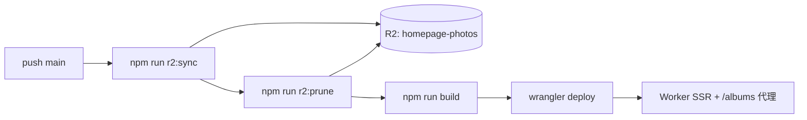

# 目标

重新整理工作流，满足更好的发布体验

# 名词解释

- /public：源代码的 public 文件夹
- 相册文件夹：/public/albums 下的某个文件夹，例如 /public/albums/hokkaido-2025
- 相册 manifest：`/public/albums/manifest.txt`，记录要发布的相册及其顺序
- 照片 manifest：每个相册目录内的 `manifest.txt`，记录要发布的照片及其顺序

# 新建像册

在 `/public/albums` 创建目录，可以新建一个像册，例如 `/public/albums/hokkaido-2025`

随后，在 `/public/albums/manifest.txt`（相册 manifest）中记录该文件夹，以换行分割，出现在 txt 里的目录视作 **发布**，同时也代表了他们的 **顺序**

相册 manifest 样板

```
hokkaido-2025
kobe-2023
okinawa-2024
```

`AlbumSchema` 结构

```ts
type AlbumSchema = {
  id: string
}
```

# 导入照片

复制照片到 `像册目录` 中，每张照片有 6 个变体，举例如下

```
/public/albums/hokkaido-2025/DSC00001-l.avif // avif l
/public/albums/hokkaido-2025/DSC00001-m.avif // avif m
/public/albums/hokkaido-2025/DSC00001-s.avif // avif s
/public/albums/hokkaido-2025/DSC00001-l.jpg // jpg l
/public/albums/hokkaido-2025/DSC00001-m.jpg // jpg m
/public/albums/hokkaido-2025/DSC00001-s.jpg // jpg s
```

随后在 `/public/albums/hokkaido-2025/manifest.txt`（照片 manifest）中记录要发布的照片，以换行分割。规则与相册 manifest 相同：出现在 txt 里的条目视作 **发布**，同时也代表 **顺序**。

与相册 manifest 的区别：每行只写 **照片基名**，不含尺寸后缀（`-l` / `-m` / `-s`）和格式后缀（`.avif` / `.jpg`）。

照片 manifest 样板（对应上面的 6 个变体文件，只需写一行 `DSC00001`）：

```
DSC00001
DSC00002
DSC00003
```

其中 sml 的尺寸分别是

`l`: 长边 3456
`m`: 长边 1728
`s`: 长边 864

`PhotoSchema` 结构

```ts
type PhotoSchema {
  id: string
  albumId: string
}
```

# 照片同步

本地 `public/albums` 中的照片体积大，不随 Worker 代码一起部署；生产环境由 Cloudflare R2 提供静态文件，Worker 按路径代理读取。

## 存储与路径

| 层级 | 路径 |
|------|------|
| 本地源 | `public/albums/{albumId}/` |
| R2 bucket | `homepage-photos`（Wrangler binding `PHOTOS`） |
| R2 object key | `albums/{albumId}/{filename}` |
| 线上 URL | `{PHOTOS_PUBLIC_URL}/albums/{albumId}/{filename}` |

相册 manifest 与各相册内的照片 manifest 只记录发布顺序，**不同步**到 R2。同步时只上传变体图片文件。

示例：本地文件

```
/public/albums/hokkaido-2025/DSC00001-l.avif
```

对应 R2 key 为 `albums/hokkaido-2025/DSC00001-l.avif`，线上地址为

```
https://homepage.kakera.workers.dev/albums/hokkaido-2025/DSC00001-l.avif
```

## 同步行为

`scripts/lib/r2-sync.mjs` 递归遍历 `public/albums/`，对每个文件执行 `bucket.put`：

- 同名 key 覆盖更新（增量发布：只改动的文件会覆盖，未改动的也会 re-put）
- 上传时按扩展名设置 `Content-Type`：`.avif` → `image/avif`，`.jpg` → `image/jpeg`
- 本地目录不存在时跳过，返回 `uploaded: 0`
- **不会**自动删除 R2 孤儿对象；删除本地文件后需运行 `npm run r2:prune`（见下文）

## Prune（清理 R2 孤儿对象）

`r2:sync` 只上传、不删除。本地已移除的照片（或整个相册目录）在 R2 上仍会保留，直到执行 prune。

**原理**：以本地 `public/albums/` 为唯一真相来源，对比 R2 中 `albums/` 前缀下的全部 object key，删除「R2 有、本地没有」的 key。`manifest.txt` 不参与对比（本来就不上传到 R2）。

典型场景：

| 操作 | 本地 | R2 prune 结果 |
|------|------|---------------|
| 从照片 manifest 移除并删除 6 变体 | 文件不存在 | 删除 `albums/{id}/DSC00001-*.avif` 等 6 个 key |
| 从相册 manifest 移除并删除整个目录 | 目录不存在 | 删除 `albums/{id}/` 下全部 key |
| 只改 manifest、文件仍在 | 文件仍在 | 不删除（sync 以磁盘文件为准，不以 manifest 为准） |

命令：

| 命令 | 作用 |
|------|------|
| `npm run r2:prune:dry-run` | 预览将被删除的 key，不实际删除 |
| `npm run r2:prune` | 删除 R2 孤儿对象 |

建议流程：先 `--dry-run` 确认列表，再执行 prune。CI 中可在 sync 之后自动 prune：

```
npm run r2:sync && npm run r2:prune && npm run build
```

Worker 拦截 `/albums/*` 请求，用去掉前导 `/` 的路径作为 R2 key 读取，响应头：

```
Cache-Control: public, max-age=31536000, immutable
```

支持 `ETag` / `304`。

## 本地命令

| 命令 | 作用 |
|------|------|
| `npm run r2:sync` | 上传 `public/albums/**` → R2 |
| `npm run r2:prune:dry-run` | 预览 R2 孤儿对象 |
| `npm run r2:prune` | 删除 R2 孤儿对象 |
| `npm run r2:setup` | 首次：`wrangler login` → 创建 bucket → 全量同步 |

首次使用前确认 `wrangler.json`：

- `r2_buckets` 绑定 `PHOTOS` → `homepage-photos`
- `vars.PHOTOS_PUBLIC_URL` 设为 Worker 公网地址（manifest 与 `` 的 base）

## CI 触发

[Workers Builds](https://developers.cloudflare.com/workers/ci-cd/builds/) 在 `main` 分支 push 时执行。照片同步放在 **build 之前**，确保部署后 R2 与仓库中的相册文件一致：

| 设置 | 值 |
|------|-----|
| Production branch | `main` |
| Build command | `npm run r2:sync && npm run r2:prune && npm run build` |
| Deploy command | `npx wrangler deploy` |

流程：



Build 环境需能访问 R2 binding（Workers Builds 使用与 `wrangler deploy` 相同的账号凭证，通过 `getPlatformProxy` 读写 bucket）。

## 发布 checklist

1. 在 `public/albums/{id}/` 放入 6 变体照片
2. 在 `public/albums/{id}/manifest.txt` 追加照片基名（如 `DSC00001`）
3. 在 `public/albums/manifest.txt` 追加 `{id}`（决定相册发布与顺序）
4. push 到 `main` → CI 自动 sync + prune + build + deploy
5. 验证线上：`{PHOTOS_PUBLIC_URL}/albums/{id}/{photoId}-l.avif`

删除照片时：先从 manifest 移除条目并删除本地 6 变体，push 后 CI 的 `r2:prune` 会清理 R2 上对应 key。

